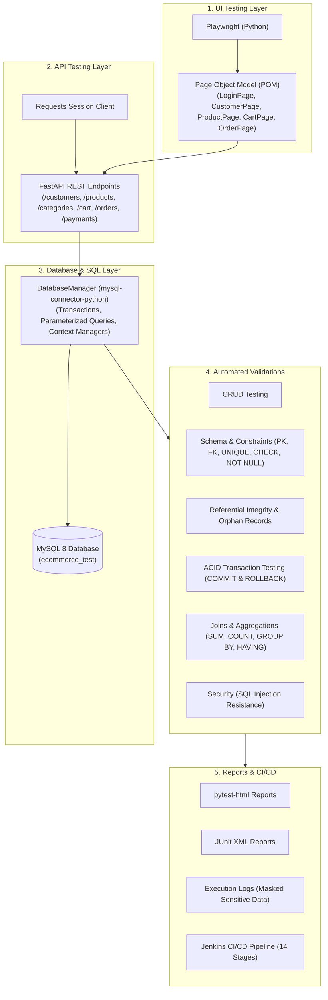

# E-Commerce End-to-End Database Testing Automation Framework

[](https://www.python.org/)
[](https://docs.pytest.org/)
[](https://www.mysql.com/)
[](https://playwright.dev/python/)
[](https://fastapi.tiangolo.com/)
[](https://www.jenkins.io/)

A production-grade, portfolio-ready **QA Automation & Database Testing Framework** engineered to validate data integrity across modern distributed web applications. This framework demonstrates how a Senior QA Automation Engineer and Database Test Automation Architect validates data end-to-end:

$$\text{User Interface (Playwright)} \longrightarrow \text{REST API (FastAPI)} \longrightarrow \text{Relational Database (MySQL 8)} \longrightarrow \text{Data Integrity \& ACID Rules}$$

---

## Architecture



---

## Technology Stack

| Component | Technology | Description |
|---|---|---|
| **Programming Language** | Python 3.11+ | Modern Python with type hints and async/sync support |
| **Test Runner** | Pytest | Test discovery, fixtures, parameterization, and markers |
| **Database** | MySQL 8.0 / MariaDB | Relational DBMS with InnoDB storage engine and strict constraints |
| **DB Driver** | `mysql-connector-python` | Native MySQL driver with parameterized query execution |
| **API Client** | `requests` | HTTP client for REST API request/response validation |
| **UI Automation** | `playwright` (Python) | Headless browser automation with Page Object Model |
| **Application Under Test** | FastAPI + Uvicorn | High-performance local e-commerce application with HTML/JS UI |
| **Data Generation** | `faker` | Synthetic, collision-free test data generation |
| **Reporting** | `pytest-html`, JUnit XML | Rich HTML test execution reports and Jenkins-compatible XML |
| **Logging** | Python `logging` | Structured execution logging with sensitive data masking |
| **CI/CD** | Jenkins | 14-stage declarative pipeline with artifact archiving |
| **Containerization** | Docker & Docker Compose | Multi-container setup for MySQL and App |

---

## Project Structure

```text
Ecommerce-Database-Testing-Automation/
├── app/                            # Application Under Test (AUT)
│   ├── main.py                     # FastAPI application entry point
│   ├── models.py                   # Pydantic data schemas and validation
│   ├── routes/                     # REST API route handlers
│   │   ├── cart.py                 # Shopping cart endpoints
│   │   ├── categories.py           # Product categories endpoints
│   │   ├── customers.py            # Customer CRUD and auth endpoints
│   │   ├── orders.py               # Order placement & stock reduction
│   │   ├── payments.py             # Payment processing endpoints
│   │   └── products.py             # Product inventory endpoints
│   └── static/
│       └── index.html              # Responsive e-commerce single-page frontend
├── config/
│   ├── __init__.py
│   └── db_config.py                # Environment variable reader and DB config
├── database/
│   ├── __init__.py
│   ├── connection.py               # Database connection manager & helper methods
│   ├── db_setup.py                 # Database initialization, seeding & reset CLI
│   ├── schema.sql                  # DDL script for all 9 relational tables
│   ├── seed_data.sql               # Realistic baseline test data
│   ├── cleanup.sql                 # Safe table truncation script
│   └── reset_database.sql          # Clean database recreation script
├── pages/                          # Playwright Page Object Model (POM)
│   ├── __init__.py
│   ├── base_page.py                # Common browser methods & screenshot capture
│   ├── cart_page.py                # Shopping cart page object
│   ├── customer_page.py            # Customer registration page object
│   ├── login_page.py               # Customer login page object
│   ├── order_page.py               # Order confirmation and payment page object
│   └── product_page.py             # Product catalog page object
├── queries/                        # SQL Query Repository Layer
│   ├── __init__.py
│   ├── cart_queries.py             # Cart & Cart Items SQL
│   ├── category_queries.py         # Category SQL
│   ├── customer_queries.py         # Customer SQL
│   ├── order_queries.py            # Orders & Order Items SQL
│   ├── payment_queries.py          # Payments SQL
│   └── product_queries.py          # Products & Aggregations SQL
├── reports/                        # Automated test execution outputs
│   ├── screenshots/                # Failure screenshots captured by Playwright
│   ├── pytest-report.html          # Self-contained HTML report
│   ├── junit-results.xml           # JUnit report for Jenkins CI
│   └── execution.log               # Detailed logs with sensitive data masked
├── tests/
│   ├── conftest.py                 # Pytest fixtures (DB, API, Browser, Page, Test Data)
│   ├── api/                        # REST API Test Suite
│   │   ├── test_customer_api.py
│   │   ├── test_product_api.py
│   │   ├── test_order_api.py
│   │   └── test_payment_api.py
│   ├── database/                   # MySQL Database Test Suite
│   │   ├── test_category_crud.py
│   │   ├── test_constraints.py
│   │   ├── test_customer_crud.py
│   │   ├── test_data_integrity.py
│   │   ├── test_joins.py
│   │   ├── test_order_crud.py
│   │   ├── test_payment_crud.py
│   │   ├── test_product_crud.py
│   │   ├── test_schema.py
│   │   └── test_transactions.py
│   ├── integration/                # Cross-tier Integration & E2E Suite
│   │   ├── test_api_database.py
│   │   ├── test_end_to_end_order.py
│   │   └── test_ui_database.py
│   └── ui/                         # Browser UI Test Suite
│       ├── test_customer.py
│       ├── test_login.py
│       ├── test_order.py
│       └── test_products.py
├── utils/
│   ├── __init__.py
│   ├── data_generator.py           # Faker-based synthetic data generator
│   └── logger.py                   # Masked logging configuration
├── .env.example                    # Environment variables template
├── .gitignore                      # Git ignore patterns
├── docker-compose.yml              # Docker container setup
├── Dockerfile                      # Application Dockerfile
├── Jenkinsfile                     # 14-stage declarative CI/CD pipeline
├── pytest.ini                      # Pytest CLI flags, markers, and reporting configuration
└── requirements.txt                # Production and test Python dependencies
```

---

## Database Schema

The `ecommerce_test` relational database is designed with 9 interconnected tables:

```
  +------------------+         +------------------+
  |    customers     |<---+    |    categories    |
  +------------------+    |    +------------------+
  | customer_id (PK) |    |    | category_id (PK) |
  | email (UNIQUE)   |    |    +--------+---------+
  +--------+---------+    |             | 1
           | 1            |             |
           |              |             | N
           | N            |    +--------v---------+
  +--------v---------+    |    |     products     |<-----------+
  |    addresses     |    |    +------------------+            |
  +------------------+    |    | product_id (PK)  |            |
  | address_id (PK)  |    |    | category_id (FK) |            |
  | customer_id (FK) |    |    | price (CHECK)    |            |
  +------------------+    |    | stock (CHECK)    |            |
                          |    +------------------+            |
           +--------------+             |                      |
           |                            |                      |
           | 1                          |                      |
  +--------v---------+                  |                      |
  |       cart       |                  |                      |
  +------------------+                  |                      |
  | cart_id (PK)     |                  |                      |
  | customer_id (FK) |                  |                      |
  +--------+---------+                  |                      |
           | 1                          |                      |
           |                            |                      |
           | N                          |                      |
  +--------v---------+                  |                      |
  |    cart_items    |                  |                      |
  +------------------+                  |                      |
  | cart_item_id(PK) |                  |                      |
  | cart_id (FK)     |                  |                      |
  | product_id (FK)  +------------------+                      |
  +------------------+                                         |
                                                               |
           +----------------------------+                      |
           | 1                          |                      |
           |                            |                      |
           | N                          |                      |
  +--------v---------+         +--------v---------+            |
  |      orders      |1       N|   order_items    |            |
  +------------------+<--------+------------------+            |
  | order_id (PK)    |         | order_item_id(PK)|            |
  | customer_id (FK) |         | order_id (FK)    |            |
  | total_amount(CHK)|         | product_id (FK)  +------------+
  +--------+---------+         +------------------+
           | 1
           |
           | N
  +--------v---------+
  |     payments     |
  +------------------+
  | payment_id (PK)  |
  | order_id (FK)    |
  | amount (CHECK)   |
  +------------------+
```

---

## Getting Started

### 1. Prerequisites
- **Python**: 3.10 or higher
- **MySQL Server**: 8.0 or MariaDB 10.5+ running on port 3306
- **PowerShell** (Windows) or **Bash** (macOS / Linux)
- **Git**

### 2. Environment Setup
Clone the repository and create a Python virtual environment:

```powershell
# Clone repository
git clone https://github.com/your-username/Ecommerce-Database-Testing-Automation.git
cd Ecommerce-Database-Testing-Automation

# Create virtual environment
python -m venv venv

# Activate on Windows PowerShell
.\venv\Scripts\Activate.ps1
# (or on bash: source venv/bin/activate)

# Install dependencies
pip install --upgrade pip
pip install -r requirements.txt

# Install Playwright browser
playwright install chromium
```

### 3. Environment Variables
Copy `.env.example` to `.env` and set your MySQL credentials:

```ini
DB_HOST=127.0.0.1
DB_PORT=3306
DB_NAME=ecommerce_test
DB_USER=root
DB_PASSWORD=your_password
API_BASE_URL=http://127.0.0.1:8000
APP_HOST=127.0.0.1
APP_PORT=8000
HEADLESS=true
```

### 4. Initialize Database
Create tables and populate seed data:

```powershell
python database/db_setup.py init
```

To clean up or reset the database at any time:
```powershell
python database/db_setup.py cleanup  # Truncates tables safely
python database/db_setup.py reset    # Recreates schema & re-seeds
```

### 5. Start the Application
Start the FastAPI server and local UI:

```powershell
uvicorn app.main:app --host 127.0.0.1 --port 8000 --reload
```
Open your browser at `http://127.0.0.1:8000` to interact with the e-commerce store frontend or `http://127.0.0.1:8000/docs` for the interactive OpenAPI documentation.

---

## Test Execution

Run the complete test suite or filter by test category using pytest markers:

### Execute Complete Suite
```powershell
pytest -v
```

### Execute by Test Marker
```powershell
# Run only Database tests
pytest -m database -v

# Run only REST API tests
pytest -m api -v

# Run only Playwright UI tests
pytest -m ui -v

# Run only Integration & End-to-End tests
pytest -m integration -v

# Run Smoke tests
pytest -m smoke -v

# Run Transaction tests (COMMIT / ROLLBACK)
pytest -m transaction -v
```

### Parallel Execution (pytest-xdist)
```powershell
pytest -n 4 -m "database or api" -v
```

---

## Test Scenarios Covered

### 1. Database Testing (25+ tests)
- **CRUD Validation**: Full Create, Read, Update, Delete cycles for Customers, Products, Categories, Orders, and Payments.
- **Constraints Enforcement**:
  - `UNIQUE`: Rejection of duplicate customer email addresses.
  - `CHECK`: Rejection of negative product prices, negative inventory stock, negative order amounts.
  - `FOREIGN KEY`: Rejection of orphan orders, non-existent category assignments, and invalid order items.
  - `NOT NULL`: Rejection of null values in mandatory fields.
- **Referential Integrity**:
  - Cascading deletes for orders and order items.
  - Verification of 0 orphan records across orders, items, and payments.
- **ACID Transactions**:
  - Validation of multi-statement `COMMIT`.
  - Atomic `ROLLBACK` when forced errors or constraint violations occur in mid-transaction.
- **SQL JOINs & Aggregations**:
  - Multi-table inner and outer joins across 6 distinct entity relationships.
  - Verification that `orders.total_amount` matches `SUM(order_items.subtotal)`.
  - Aggregation metrics (`COUNT`, `SUM`, `AVG`, `MIN`, `MAX`, `GROUP BY`, `HAVING`).
- **Information Schema Verification**:
  - Dynamic verification of all 9 tables, column types, primary keys, and foreign keys.
- **Security & Performance**:
  - SQL injection resistance verification using parameterized queries.
  - Query execution latency benchmark validation (<500ms).

### 2. API Testing (14+ tests)
- HTTP Status Codes (200, 201, 400, 404, 409, 422).
- JSON Response Schema validation and field type checking.
- Boundary condition validation (zero, negative, excessively long strings).
- Duplicate resource rejection handling.

### 3. UI Testing (8+ tests)
- Page Object Model architecture isolating locators from assertions.
- Customer registration flow and duplicate submission error feedback.
- Customer login with positive and negative credential scenarios.
- Dynamic product catalog rendering and inventory counter display.
- Interactive Shopping Cart operations, checkout, and order placement.
- Automated screenshot capture upon any UI test failure.

### 4. Integration Testing (7+ tests)
- **API-to-Database Validation**: Endpoints create records via HTTP; the test queries MySQL to verify matching field-level persistence.
- **UI-to-Database Validation**: Browser actions trigger database state changes; direct SQL queries verify backend truth.
- **End-to-End Business Flow**:
  1. Customer registration $\to$
  2. Address creation $\to$
  3. Product catalog creation $\to$
  4. Cart addition $\to$
  5. Checkout order creation $\to$
  6. Payment authorization $\to$
  7. Inventory stock automatic decrement $\to$
  8. Relational database verification across all 9 tables.

---

## Test Reports & Artifacts

After execution, reports are generated automatically under `reports/`:

- **HTML Report**: `reports/pytest-report.html` (interactive, self-contained HTML with metrics and failure details)
- **JUnit XML Report**: `reports/junit-results.xml` (standard XML formatted for Jenkins CI test result publishing)
- **Execution Log**: `reports/execution.log` (chronological trace with SQL execution times, API calls, and masked credentials)
- **Failure Screenshots**: `reports/screenshots/*.png` (automatically captured by Playwright whenever a UI assertion fails)

---

## Jenkins CI/CD Pipeline

The framework includes a production-ready declarative `Jenkinsfile` executing 14 structured stages:

```text
Pipeline Stages:
1. Checkout source from Git
2. Set up Python virtual environment
3. Install dependencies & Playwright Chromium
4. Verify MySQL server connectivity
5. Initialize schema & seed test data
6. Launch FastAPI background application daemon
7. Run Database Tests (pytest -m database)
8. Run API Tests (pytest -m api)
9. Run UI Tests (pytest -m ui)
10. Run Integration Tests (pytest -m integration)
11. Generate consolidated HTML & JUnit reports
12. Archive reports, screenshots, and logs
13. Publish JUnit test results in Jenkins
14. Tear down application server and cleanup environment
```

---

## Git Commit History Strategy

Recommended logical commits for repository submission:

```bash
git add .
git commit -m "feat: initial project structure, requirements, and configuration"
git commit -m "feat(database): add schema DDL, seed data, and connection manager"
git commit -m "feat(queries): add query layer for customers, products, orders, and payments"
git commit -m "feat(app): add FastAPI e-commerce backend and interactive UI"
git commit -m "feat(pom): add Playwright Page Object Model classes"
git commit -m "test(database): add CRUD, constraint, join, transaction, and integrity tests"
git commit -m "test(api): add REST API test suite with status and schema validation"
git commit -m "test(ui): add Playwright UI test suite"
git commit -m "test(integration): add API-to-DB, UI-to-DB, and E2E business flow tests"
git commit -m "ci(jenkins): add 14-stage declarative Jenkinsfile and Docker configuration"
git commit -m "docs: add comprehensive architecture documentation and user guide"
```

---

## License

This project is licensed under the MIT License - open for educational and portfolio demonstration purposes.

